# Momentum 360 pipeline architecture for M360 Orbit

**Prepared:** July 16, 2026  
**Product in scope:** the existing M360 Orbit roster of 19 specialists  
**Public site:** frozen and unchanged  
**Operating posture:** private shadow system first, read-only evidence by default, human approval before every external action

## Executive design decision

Do not rebuild the public Orbit experience and do not create 19 disconnected bots. Keep the 19 names as stable specialist contracts and add one private Momentum orchestration layer behind a separate authenticated boundary.

The orchestration layer should decide which specialist owns a job, retrieve only the permitted evidence for that client, produce a structured work artifact, run specialist and policy checks, and stop at a review queue. Execution adapters remain disabled until a named human approves an exact preview.

This turns Orbit from a useful public planning demo into a repeatable Momentum operating system without risking the live site or mixing client data.

## What exists today

The current product has:

- a fixed roster and deterministic keyword router;
- three general playbook steps for each specialist;
- a Responses API call with `store: false`;
- a public question-and-plan experience;
- no retrieval, source citations, tenant isolation, live evidence adapters, approval records, or action receipts.

Those constraints are acceptable for the public preview. They are not enough for client delivery or pipeline operations.

## Target architecture

```mermaid
flowchart LR
    A["Request or scheduled work"] --> B["Identity and client resolver"]
    B --> C["Intent router and risk classifier"]
    C --> D["Orbit specialist contract"]
    D --> E["Namespace-filtered retrieval"]
    E --> F["Evidence bundle with freshness and conflicts"]
    F --> G["Plan and artifact generator"]
    G --> H["Specialist QA, policy QA, and client QA"]
    H --> I["Human review queue"]
    I -->|"Changes requested"| G
    I -->|"Approved exact action"| J["Isolated execution adapter"]
    J --> K["Action receipt and audit log"]
    K --> L["Outcome and learning record"]
    L --> M["Eval set and approved knowledge proposal"]
    M --> D
```



## Eight isolated layers

### 1. Request intake

Accept a manual request, a scheduled read-only job, or an approved system event. Normalize it into a `WorkRequest`. Do not allow connector output or retrieved text to become system instructions.

Required fields:

- request ID and created time;
- requester and role;
- exact Momentum or client workspace;
- business objective;
- requested deliverable;
- deadline and urgency;
- systems allowed for read;
- actions explicitly requested;
- approval state.

### 2. Identity and tenant boundary

Resolve the exact client before any retrieval. Each client gets an isolated workspace and retrieval filter. A request with a missing or ambiguous client ID stops before private retrieval.

Recommended namespace keys:

- `environment`: public, internal, client, live-evidence, action;
- `client_id`: canonical client registry ID or null;
- `specialist_id`: one of the 19 existing IDs;
- `source_tier`: A through E;
- `sensitivity`: public, internal, client-confidential, restricted;
- `effective_at`, `retrieved_at`, and `expires_at`;
- `approval_state`: proposed, approved, expired, revoked.

### 3. Routing and risk classification

The current keyword router remains useful as a transparent baseline, but private Orbit needs two decisions:

1. Which specialist owns the primary output?
2. What risk class and approval path apply?

Use deterministic overrides for explicit specialist selection and hard-risk rules. Let the model classify ambiguous marketing intent only after client identity is resolved. SCOPE is the fallback for reporting and unclear multi-channel diagnosis, not a license to invent context.

Risk classes:

- `R0`: public education or synthetic planning;
- `R1`: internal draft using approved Momentum knowledge;
- `R2`: client artifact using private evidence;
- `R3`: external communication, publishing, spend, CRM write, account change, or prospect promotion;
- `R4`: regulated, legal, privacy-sensitive, or high-impact work requiring a named qualified reviewer.

R3 and R4 always stop at a human approval record.

### 4. Retrieval and evidence assembly

Retrieve in this order:

1. current client facts and controlling scope;
2. current Momentum SOP and specialist contract;
3. current first-party platform policy;
4. live read-only evidence for the exact time window;
5. relevant vertical playbook;
6. lower-tier context, clearly labeled.

Each retrieved passage becomes an `EvidenceItem` with source, tier, date, freshness, namespace, client ID, allowed use, and verification state. The generator receives the evidence bundle, not unrestricted access to every client source.

OpenAI vector stores can support semantic retrieval and file-attribute filtering. Use separate stores per client or enforce server-side compound filters that include the exact `client_id`, environment, approval state, and freshness. Never rely on the model to remember to separate tenants. See the [OpenAI vector store reference](https://platform.openai.com/docs/api-reference/vector-stores/list) and [vector store file attributes](https://platform.openai.com/docs/api-reference/vector-stores-files).

### 5. Specialist planning and artifact generation

Every specialist consumes a bounded evidence bundle and returns a typed artifact. Free-form prose can be included for the reviewer, but the operational result must validate against a schema.

Required output envelope:

- specialist and routing reason;
- client and business objective;
- verified facts;
- inferences;
- recommendations;
- missing evidence and conflicts;
- prioritized actions with owner, deadline, and success measure;
- source list;
- QA results;
- external-action preview, if any;
- required approver.

### 6. Quality and policy gates

Run deterministic checks before model-based grading:

- schema validity;
- client ID match across request, evidence, and artifact;
- required-source presence and freshness;
- whole-number lead and conversion counts for Momentum reporting;
- no invented credentials, people, numbers, approvals, claims, or testimonials;
- no external action without a named approval record;
- no client-private material in a public or different-client artifact.

Then run specialist rubrics from the deep knowledge chapters. Failed critical checks block the artifact. Noncritical gaps return it for revision.

### 7. Human review and action boundary

An `ApprovalPacket` contains exactly what will happen:

- action type;
- destination account and client;
- final message, asset, change set, budget, or record mutation;
- recipients or audience;
- supporting evidence;
- expected effect;
- rollback or recovery method;
- approver;
- expiration time;
- immutable content hash.

Approval applies only to that exact hash and destination. Editing the content, recipient, account, budget, or target invalidates approval. Research completion never implies permission to contact a prospect.

### 8. Execution, receipts, and learning

Each connector has a separate action adapter. Read and write credentials are separated where the platform allows it. The adapter must revalidate client, account, approval hash, expiry, and permissions immediately before execution.

Return an `ActionReceipt` with system ID, target, actor, time, final content hash, outcome, and error state. Store a redacted audit record. Feed only approved, de-identified operating lessons into Momentum-wide knowledge. Client facts stay in the client workspace.

## Model strategy after GPT-5.6

The 19 specialists are product and operating roles, not a requirement to run 19 expensive model instances. Route model capacity by job difficulty and risk.

| Work type | Default tier | Examples |
| --- | --- | --- |
| Deterministic extraction, labeling, formatting, first-pass routing | Luna or code | source metadata, field normalization, format checks |
| Routine grounded specialist artifact | Terra | one-channel brief, content derivatives, local listing checklist |
| Multi-source diagnosis, high-value synthesis, adversarial QA | Sol | account strategy, integrated report, cross-agent plan, disputed evidence |
| Complex bounded parallel research | Sol with explicit subjobs | deep audit across capture, search, demand, and operations |

GPT-5.6's official launch describes Sol, Terra, and Luna as capability tiers and introduces programmatic tool calling and beta multi-agent execution in the Responses API. Use those capabilities for bounded orchestration, but keep business state, tenant enforcement, approvals, and audit logs in Momentum-controlled code. Model choice must remain configuration-driven and eval-gated rather than hardcoded. See [OpenAI's GPT-5.6 launch](https://openai.com/index/gpt-5-6/) and [current model guide](https://developers.openai.com/api/docs/models).

For privacy design, treat response state and knowledge storage as separate controls. The current public function's `store: false` should remain, while any vector store, connector cache, and audit log receives an explicit retention and deletion policy. OpenAI documents endpoint-specific data controls and notes that background mode has different retention implications; review the [current data controls](https://platform.openai.com/docs/models/default-usage-policies-by-endpoint) before enabling it for client data.

## Exact 19-agent operating map

| Stage | Primary specialist | Required handoff |
| --- | --- | --- |
| Capture strategy | VERA | scene plan to LENS, FRAME, AERO, and PATCH |
| Still-image proof | LENS | approved asset map to PRISM, HOOK, STUDIO, and MAPS |
| Aerial context | AERO | compliant shot plan to FRAME and VERA |
| Motion narrative | FRAME | master story and clip inventory to FORGE and STUDIO |
| Authority recording | WAVE | transcript and evidence moments to FORGE, ATLAS, and HOOK |
| Search and AI visibility | ATLAS | topic and page map to PATCH, FORGE, and SCOPE |
| Google Business Profile | MAPS | verified identity and local proof to GRID, ECHO, and SCOPE |
| Local Service Ads | SIGNAL | service-area and qualified-call economics to HOOK and SCOPE |
| Listing consistency | GRID | canonical entity record and issue queue to MAPS and PATCH |
| Meta demand | PULSE | offer, creative test, and qualified-conversion brief to HOOK, STUDIO, and SCOPE |
| Conversion message | HOOK | approved copy variants to PATCH, PULSE, PIN, REVIVE, and STUDIO |
| Pinterest discovery | PIN | intent clusters and destination requirements to LENS, HOOK, and PATCH |
| Dormant pipeline | REVIVE | segmented, suppression-checked reactivation draft to HOOK and SCOPE |
| Reviews and reputation | ECHO | themes and response drafts to MAPS, PRISM, FORGE, and operations owner |
| Social campaigns | STUDIO | calendar and asset requests to FORGE, LENS, FRAME, and SCOPE |
| Repurposing | FORGE | channel-native package to STUDIO, ATLAS, HOOK, and account owner |
| Brand system | PRISM | approved claims, voice, and visual rules to every specialist |
| Reporting | SCOPE | decision brief and anomalies to the accountable channel specialist |
| Website conversion | PATCH | prioritized issue and test backlog to HOOK, ATLAS, MAPS, and implementation owner |

## Momentum pipeline: Maps-first prospect pilot

This pilot implements Melissa's actual request. Google Maps is the discovery and identity source. Instagram may support research but is not the source of truth.

### Stage 0: pilot definition

Human inputs: one market, one business category, one Momentum service offer, disqualifiers, maximum batch size, and named reviewers.

### Stage 1: public discovery

MAPS discovers public business records from the authorized Maps or Places route. GRID normalizes identity. Required evidence includes business name, category, address or service area, public phone, website, Maps URL or place ID, hours, and observation time.

No decision-maker identity, private email, consent, or outreach permission may be inferred.

### Stage 2: service-fit diagnosis

PATCH reviews the public website. ATLAS reviews search and answer visibility. MAPS reviews profile completeness. PRISM checks positioning. SCOPE assembles a short evidence-backed opportunity score.

Every weakness needs a public evidence locator. Missing evidence remains pending rather than becoming a negative claim.

### Stage 3: opportunity brief

HOOK turns verified gaps into a factual opportunity statement. The correct capture specialist adds a proof concept. FORGE packages the audit, concept, or short briefing artifact. Claims, logos, testimonials, imagery, and contact data remain restricted until reviewed.

### Stage 4: human qualification

The reviewer marks each prospect rejected, needs research, qualified for concept, or approved for an outreach draft. This decision includes owner, rationale, suppression status, and expiration.

### Stage 5: draft only

REVIVE or HOOK may prepare a one-to-one draft using only verified public facts and approved Momentum claims. No Zap, CRM write, postcard, email, Slack, SMS, call task, or social message occurs.

### Stage 6: exact approval and execution

A named human approves the exact prospect, recipient, message, channel, sender identity, and timing. Only then can the isolated connector perform one bounded action and return a receipt.

### Pilot KPIs

- percent of records with complete, reproducible identity evidence;
- false-positive and duplicate rate;
- percent of opportunity claims accepted by human reviewers;
- research time per qualified prospect;
- approval rate for site or audit concepts;
- positive reply and booked-conversation rate only after approved outreach begins;
- unsubscribe, complaint, suppression, and incorrect-contact rate;
- revenue and delivery capacity by service, not raw lead volume alone.

## Existing-client delivery lanes

The same architecture supports current Momentum work without mixing it with prospecting:

1. **Reporting lane:** SCOPE resolves definitions and sources, then routes anomalies to the responsible specialist. Melissa's dashboard remains a reporting artifact; her Maps request is a separate upstream prospecting lane.
2. **Local visibility lane:** MAPS, GRID, ATLAS, ECHO, and PATCH maintain a verified issue backlog and review packet.
3. **Content lane:** WAVE or a client source feeds FORGE; PRISM constrains voice and claims; ATLAS, STUDIO, PIN, HOOK, and ECHO receive channel-specific derivatives.
4. **Capture lane:** VERA, LENS, AERO, and FRAME produce one coordinated capture brief that connects each asset to a sales, listing, Maps, ad, website, or content job.
5. **Demand lane:** PULSE, SIGNAL, HOOK, REVIVE, and PATCH work from approved offers and conversion definitions; SCOPE reports qualified outcomes.

## Work-object state machine

```text
new
  -> identity_resolved
  -> evidence_pending | evidence_ready | blocked
  -> draft_ready
  -> qa_failed | review_ready
  -> changes_requested | rejected | approved
  -> execution_pending
  -> executed | execution_failed | approval_expired
  -> outcome_pending
  -> measured
  -> archived
```

No state transition skips `review_ready` and `approved` for an R3 or R4 action. A work item cannot change clients. A new client context creates a new work item.

## Delivery plan

### Phase 0: frozen baseline

- Keep the public Netlify site and current API unchanged.
- Preserve the nine-test baseline.
- Finish specialist contracts, governance, evals, and data schemas locally.

Exit gate: all 19 chapters pass completeness review and no site files change.

### Phase 1: private shadow orchestrator

- Build a separate authenticated service or local operator.
- Use sanitized Momentum knowledge and synthetic client cases.
- Produce artifacts only; no connectors write.
- Run routing, grounding, client isolation, and approval-boundary evals.

Exit gate: critical checks pass 100 percent and reviewer acceptance is at least 85 percent on the pilot set.

### Phase 2: one client-safe read-only pilot

- Pick one narrow lane and named owner.
- Connect only required read sources.
- Log evidence and reviewer decisions.
- Keep all communication, publishing, CRM, ad, and account writes disabled.

Exit gate: reproducible evidence, acceptable time savings, and zero cross-client or unauthorized-action failures.

### Phase 3: approval-gated single actions

- Enable one action type at a time.
- Require exact immutable approval packets.
- Add receipts, alerts, retries, and rollback.
- Keep batch actions and spend disabled.

Exit gate: successful controlled actions and no policy or destination errors.

### Phase 4: scaled Momentum operating system

- Add client workspaces and lane-specific automations gradually.
- Promote only approved, de-identified lessons to shared knowledge.
- Run regression evals before every model, prompt, knowledge, or connector release.

The OpenAI Evals API can manage repeatable evaluation sets and graders, but release gates and business approvals remain Momentum-owned controls. See the [OpenAI Evals reference](https://platform.openai.com/docs/api-reference/evals).

## Recommended first decision

At the July 17 AI review, approve only a shadow pilot definition:

- one market;
- one category;
- one Momentum service offer;
- ten to twenty public businesses;
- read-only research;
- no CRM writes;
- no outreach;
- named reviewer for identity, opportunity claims, and concept quality.

This produces real evidence about whether the 19-agent operating model improves Momentum's pipeline without exposing the company to a premature site change or uncontrolled automation.
