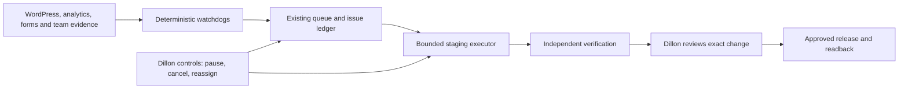

# Aegis for Momentum

Status: initial monitor active and CMS copy repair drafted; goal active. September 23, 2026. NeedMomentum.com is the first property; Momentum Virtual Tours remains separately scoped.

## Confirmed brief

Automatically monitor and prepare reversible local/draft/staging fixes. Publishing, sending, spending, destructive operations and security/access changes require approval. No Mac messages this session. Design: existing Momentum brand with Art Nouveau details; preserve the official logo and verify tree artwork provenance.

## Outcomes and sequence

| Phase | Parallel work | Acceptance evidence |
|---|---|---|
| 0. Baseline | 2026 history, backend, analytics/lead mapping, existing schedulers and code | Source/date, current state, owner and reproduction for each issue |
| 1. Recovery foundation | Hosting/staging access, backup restore, plugin dependencies, firewall/cron/cache diagnosis | Isolated staging, successful restore, tested rollback and release owner |
| 2. Conversion and maintenance | Six-field audit, delivery adapters, staged updates, tracking | Intake saved once; report QA; sandbox delivery/CRM receipts; one conversion after success; no duplicate replay |
| 3. Branded redesign | Homepage, service/case-study templates, query-to-page map, content, accessibility | Approved concept, verified assets/proof, desktop/mobile QA, URL/canonical preservation, measured performance |
| 4. Aegis shadow operation | Watchdogs, bounded executors, verifier, staff controls | Duplicate/stale jobs suppressed; cancellation effective; account isolation; zero unapproved writes |
| 5. Reviewed release | Small changesets, backup, signoff, rollout and monitoring | Explicit release approval, live readback/receipts, rollback on agreed failure criteria |

Repair lead capture before a broad redesign. Keep WordPress as the publishing system unless measured constraints justify migration. Reuse DeerFlow for coordination and Docker for existing services.

## Evidence

- BACKEND-BASELINE.md: authenticated forms, plugins, health, firewall and reporting.
- HISTORY.md: dated Slack/Gmail themes, resolution evidence and coverage gaps.
- AUTOMATION-INVENTORY.md: initial automation inventory. Existing heartbeat daily-momentum-semrush-opportunities was extended and activated as Aegis Momentum website watch at 09:00 Eastern; persisted configuration read back. Migrate scheduling ownership to DeerFlow only after parity tests and disabling the old trigger.
- DEERFLOW-INTEGRATION.md: implemented integration points and missing controls.
- 47 joined public/private channels were enumerated. Workspace-wide relevant searches can cover accessible messages; this does not establish access to all private channels or exhaustive history review.
- Hosting backups, Search Console trends, SMTP receipts and production release/restore paths remain unverified.

## Watchdogs and executors

### Historical priorities

The January–September channel review ranks recurring operational problems as: (1) page speed and frontend/plugin weight, still explicitly open September15–21; (2) indexing/ranking and on-page hygiene, with individual fixes but later recurrence; (3) lead routing and attribution, including a March17hats outage and August/September tracking gaps; (4) deliverability and domain authentication, with no clean later resolution receipt found; (5) intermittent availability/admin/navigation faults, with point-in-time recovery reports. See HISTORY.md for exact dates/links and limits. These are reported symptoms and resolution claims, not independently measured traffic or uptime trends.

The daily public watch is active. The finer-grained cadences below remain proposed. One coordinator and shared state; deterministic checks first, models only for changed issues requiring judgment.

| Lane | Watch | Automatic local/draft/stage work | Escalate |
|---|---|---|---|
| Availability | Existing uptime source or 15-minute checks; two consecutive failures | Incident evidence, staging reproduction, rollback proposal | Confirmed outage or primary CTA failure |
| Backend/security | Daily plugin/core/theme/cron/WAF/backup-state diff | Dependency analysis, staged update, configuration proposal | Failed backup, confirmed vulnerability, suspicious change or expired learning period |
| Forms/audit | Six-hour non-submitting health; sandbox test after change | Validation, queue/status, modal and field-map fixes | Accepted lead without durable storage/delivery |
| SEO/keywords | Daily indexability/sitemap/canonical changes; weekly GSC review | Metadata, internal links, content drafts, redirect map | Accidental noindex/block, canonical drift, sustained comparable-period drop |
| AEO/content | Weekly factual/entity/schema review | Clear answers, cited proof, consistent service facts | Unsupported or conflicting claims |
| Performance/UX | Each staged release and weekly representative mobile pages | Asset/layout/script optimization | Broken navigation, overflow or measured regression |
| Email/CRM/attribution | Daily integration health; weekly lead reconciliation | Template/field-map fixes, sender-auth proposal, failure queue | Wrong owner, bounces, missing/duplicate conversion |
| Staff assistance | New relevant work since checkpoint | Assign owner, draft solution, attach artifact | Conflicting edits, missing authority, account mismatch |

Aegis complements host and Wordfence protections; it does not replace a web application firewall. No compromise has been established. Search work uses accurate content and legitimate technical improvements.

## Control contract

DeerFlow source review confirms a reusable scheduler/run lifecycle, run receipts and separate cancellation. Schedule pause cancels queued occurrences and can reject active work; it is not an active-run kill switch. Durable action-bound approval and a WordPress connector are missing. Initial executors must therefore be restricted to local artifacts, with no production CMS mutation capability. Scheduled runs are non-interactive: missing access or ambiguous inputs produce a blocked receipt, not an assumed approval. Add no new Docker service for this first phase. See DEERFLOW-INTEGRATION.md for source anchors and required negative tests.

Proposed flow: observed → triaged → assigned → staged → verified → awaiting approval → released → monitored → closed. Include failed, blocked and cancelled states.

Every item has a site/account ID, source link, observation time, target, baseline revision/hash, allowed actions, owner, acceptance test, rollback and result receipt. Reuse the canonical queue and existing DeerFlow artifact model.

Dillon controls pause-all/pause-lane, worker enablement, budgets, concurrency, inspect evidence, approve/reject a particular diff, cancel, reassign and request rollback. Executors recheck permission and baseline before applying changes. One writer lease per target; human changes invalidate stale patches.

Keep read, stage-write and release capabilities separate. Public monitors need no admin credential. Store secret references through the existing secret system; keep Docker services private and avoid privileged container access for generic workers. Start at three independent work items. Bound retries, stop a repeatedly failing lane, and never blindly replay external sends.

## Design brief

Public site: help small and multi-location businesses understand the offer, trust real evidence and request an audit. Sequence: focused hero/CTA, verified proof, services, case studies, people/process, useful answers, audit/contact.

Preserve the exact logo and verified company/founder imagery. Use blue/orange Momentum identity with readable neutral surfaces. Express Art Nouveau through restrained botanical curves, branching linework, crafted borders and editorial composition. A tree remains decorative unless approved brand provenance is established. Forms/navigation stay direct.

Reuse the existing homepage concept source and token work. Older Signal concepts have a blue/yellow palette; the later shared kit is blue/orange. This session confirms blue/orange. Prototype one homepage, one service template and the audit journey before expanding to every page. Review a visual comp before broad implementation; build-path preference is still open.

Validate keyboard/focus, 200% zoom, 320px layout, reduced motion, accessible errors, image dimensions and readable fallbacks. Motion must support comprehension and performance. An overlay does not replace accessibility testing. Preserve existing URLs or explicitly map redirects before release.

## Measurement

Baseline March 23–September 23 and January 1–September 23 GSC query/page trends, with comparable periods and seasonality. Split brand/nonbrand, service/location, mobile/desktop and qualified leads. Reconcile GA4, WhatConverts, form storage and CRM; configured integrations do not prove delivery.

Live settings identify GTM-57PVS88, GA4 property318849928 and WhatConverts profile150674. Verify ownership/native readbacks before changes. The existing Monday report should be reused, with actual delivery checked.

Google says established SEO practices remain relevant to its AI features: [Google AI search guidance](https://developers.google.com/search/docs/appearance/ai-features). Prioritize crawlability, useful content and structured data matching visible facts; do not promise AI placement. Recovery guidance: [WordPress hardening](https://developer.wordpress.org/advanced-administration/security/hardening/). Firewall behavior: [Wordfence learning mode](https://www.wordfence.com/help/firewall/learning-mode/).

## Token/model stewardship

Process deltas since checkpoints, deduplicate by stable source/issue ID, share compact artifacts, and do not repeat another worker's research. Use deterministic extraction and checks before models; expand verification only for a failure or unresolved risk.

Verified routes this session: GPT-6 Luna Max implemented the public prototype; GPT-6 Sol reviewed the persistence fix. The native Muse Spark 1.3 Contributor child failed with an unsupported ChatGPT-session route, so availability is not claimed. Exact names Spark4.3 and Llama Max6 remain unverified. No Astra lane selected.

Jev also supports the installed structured research-evidence helper, beyond the small UI-choice helper. A live public-only test used verify-claims.mjs: 12 atomic checks across two claims took 1,100 ms, used 2,912 input/244 output tokens, and reported $0.000000 gateway billed cost. It accepted the Google-specific claim and flagged an unsupported cross-engine generalization. See jev-public-research-result.txt. This verifies fast evidence screening; it does not establish a standalone browsing/deep-research agent. Reuse Jev for bounded public evidence checks, with source collection and synthesis handled by the existing research workflow. Private Slack and secrets require approved provider handling. Cost is the observed run cost, not a future price guarantee.

## Current state

The existing heartbeat is ACTIVE daily at 09:00 Eastern. The public GET-only monitor passed its self-test and two live runs; the host challenges direct requests, so coverage is degraded rather than proof of an outage. The second unchanged observation produced no new change. WordPress draft29608 was copied from5894, edited, saved and previewed with one H1 and truthful copy; the draft has no connected audit form yet. See WATCHDOG.md and CMS-DRAFT.md.

The local Nouveau homepage now includes the exact logo, real founder imagery, five interactive service details and a six-field local audit demo. Typecheck, standalone production build, required-field recovery, no-network submission and 320/390px overflow checks passed. Source and screenshots are indexed in PROTOTYPE-VERIFICATION.md. A homepage prototype is not the complete multi-page redesign or a live intake funnel.

The shared intake store refuses configured database failures and serving requires DATABASE_URL. submitIntake now flushes its event before success; three focused checks and independent review passed. A disposable PostgreSQL16 restart preserved exactly one synthetic intake, audit job and event, with encrypted fields correctly hydrated. Both test containers are stopped. Turnstile server validation, required hostname, environment mapping and conditional form widget are implemented locally; eight focused checks passed. Actual HTTPS hosting, provider credentials, delivery adapters and CMS connection remain release gates. See INTAKE-RELEASE-READINESS.md.

The public scan covered 90 discovered requested URLs, resolving to 89 unique final pages after one contact-page redirect duplicate. All 89 captures completed; 17 checks per page produced 1,513 check results, not 1,513 page visits. Material findings: 13 declared canonical mismatches, eight multiple-H1 pages, 40 heading-skip pages and 13 duplicate-ID pages. Canonical candidates and five conversion/link repairs are drafted in bulk-scan-output. Accessible-name, label and image-layout heuristics require manual confirmation; the scan does not measure ranking impact or delivery.

DeerFlow live readback showed no schedules and authorization.enabled=false; a model label and healthy containers do not prove an enforced executor boundary. Existing authorization tests passed 12/12. Enablement, action-bound approvals, WordPress connector and cancellation/isolation rehearsal are still outstanding; see DEERFLOW-INTEGRATION.md. Independent GSC/mail/uptime evidence and backup restore remain unverified.

The disposable DeerFlow policy rehearsal passed schema, visible-tool filtering and invocation-denial checks using existing RBAC and GuardrailMiddleware. No runtime policy changed. It supports read/presentation only and does not enforce owner/path/site scopes; see deerflow-policy-rehearsal/README.md. The expanded batch dispatched eight GPT-6 Sol and eight GPT-6 Luna Max workers across bounded work. Muse Spark1.3 was attempted but rejected by this account route; no Muse execution is claimed.
